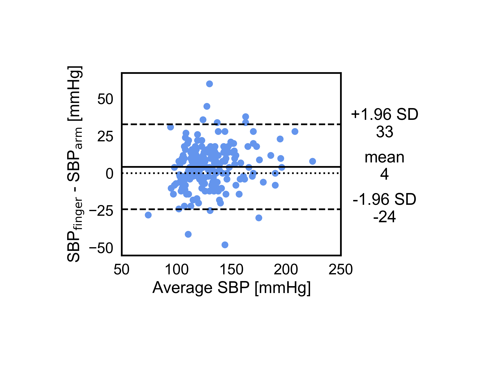

# Bland-Altman Plot
Script to generate a Bland-Altman plot which is a method of data plotting used in analyzing the agreement between two different measurements. The plot uses systolic blood pressure measurements from the arm and finger for demonstration.

The dataset used for demonstration is featured in the following publication:

[Bland, J. M., & Altman, D. G. (1995). Comparing methods of measurement: why plotting difference against standard method is misleading. The lancet, 346(8982), 1085-1087.](https://doi.org/10.1016/S0140-6736(95)91748-9)

installation:

```bash
pip install -r requirements.txt
```

usage:

```bash
python panel_plot.py
```

Cite As

[Nzakimuena, C. B., Solano, M. M., Marcotte-Collard, R., Lesk, M. R., & Costantino, S. (2025). Spatial and temporal changes in choroid morphology associated with long-duration spaceflight. Investigative Ophthalmology & Visual Science, 66(5), 17-17.](https://doi.org/10.1167/iovs.66.5.17)

